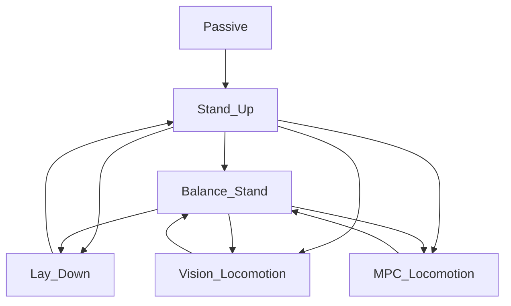
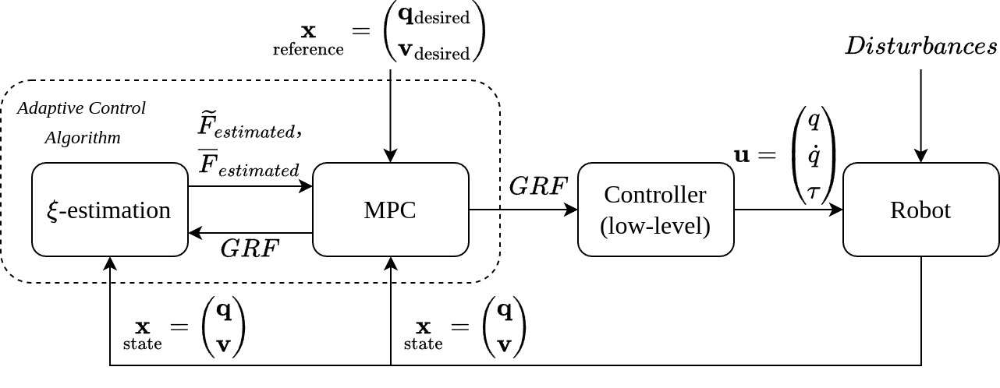

# Periodic_Adaptive_MPC

This repository contains an Adaptive Model Predictive Control (Adaptive MPC) approach designed specifically for quadrupedal robots operating under periodic disturbances.


# Install

First install raisim_ros_wrapper repository, which provides a ROS-based simulation environment using the RaiSim physics engine:

```
cd <path_to_ws>/catkin_ws
mkdir src
cd src
git clone https://gitlab.com/rl-unitree-a1/raisim_ros_wrapper.git
catkin config --cmake-args -DCMAKE_BUILD_TYPE=Release
```

Then, clone this repository to <path_to_ws>/src:
```
git clone https://github.com/LizaP9/Periodic_Adaptive_MPC.git
```

Build and source workspace (Use the --jobs 2 flag if your CPU resources are limited to help avoid build errors.):
```
catkin build --jobs 2
source devel/setup.bash
```

# Usage

## Raisim simulator

In first terminal launch the visualizer. You can choose one of the following (opengl is easier for visualization):
```
# unity
roslaunch raisim unity.launch
# opengl
roslaunch raisim opengl.launch
```

In second terminal launch the Raisim server:
```
roslaunch raisim_unitree_ros_driver spawn.launch scene:=2
```
Arguments:
- scene - - indicates which objects will be created in the simulator scene.

In third terminal launch the controller for the simulator with the universal launch file:
```
roslaunch be2r_cmpc_unitree unitree_a1.launch sim:=true rviz:=false rqt_reconfigure:=true
```

Arguments:
- sim - (bool) whether running in simulation or on a real robot;
- rviz - (bool) whether to start RViz;
- rqt_reconfigure - (bool) whether to start rqt.


## Real Unitree A1
Launch the controller to control the real robot (separate launch file):
```
roslaunch be2r_cmpc_unitree unitree_real.launch
```

Launch the controller for the simulator with the universal launch file:
```
roslaunch be2r_cmpc_unitree unitree_a1.launch sim:=false rviz:=false rqt_reconfigure:=false
```
Arguments:
- sim - (bool) whether running in simulation or on a real robot;
- rviz - (bool) whether to start RViz;
- rqt_reconfigure - (bool) whether to start rqt.

## Finite State Machine (FSM)
You can exit from a gait state to the Passive state in two ways:
1. From any state directly. The motors switch to damping mode, and the robot smoothly goes to the ground.
2. Switch first to Balance_Stand, then Lay_Down, and finally Passive.


## Control System Description

Control system architecture:
 

## Adaptive MPC

### Mathematical Formulation

The discrete-time dynamics of a quadrupedal robot under periodic disturbances are represented as:

```math
\begin{equation*}  
x_{k+1} = A_d x_k + B_d u_k + G_d + Q_d \xi_k,
\end{equation*}
```

where:

```math
\begin{equation*}
A_d = \begin{bmatrix}
1_{3\times3} & 0_{3\times3} & T(\theta)\Delta t & 0_{3\times3} \
0_{3\times3} & 1_{3\times3} & 0_{3\times3} & 1_{3\times3}\Delta t \
0_{3\times3} & 0_{3\times3} & 1_{3\times3} & 0_{3\times3} \
0_{3\times3} & 0_{3\times3} & 0_{3\times3} & 1_{3\times3}
\end{bmatrix},
\end{equation*}
```

```math
\begin{equation*}
B_d = \begin{bmatrix}
0_{3\times3} & \dots & 0_{3\times3} \
0_{3\times3} & \dots & 0_{3\times3} \
I^{-1}[r_1]\times \Delta t & \dots & I^{-1}[r{n_c}]\times \Delta t \
1_{3\times3}\Delta t/m & \dots & 1_{3\times3}\Delta t/m
\end{bmatrix},
\end{equation*}
```

```math
\begin{equation*}
Q_d = \begin{bmatrix}
0_{6\times6} \
1_{6\times6}
\end{bmatrix}, \quad
G_d = [0 ; 0 ; 0 ; 0 ; 0 ; 0 ; 0 ; 0 ; 0 ; 0 ; 0 ; g]^T
\end{equation*}
```

where:

- $\theta$: Orientation of the robot's base  
- $T(\theta)$: Transformation matrix from Euler angles to angular velocities  
- $\Delta t$: Discrete time step  
- $I$: Inertia matrix of the robot  
- $[r_i]_{\times}$: Cross-product matrix associated with vector $r_i$  
- $m$: Mass of the robot  
- $g$: Gravitational acceleration  


### Disturbance Estimation

The external periodic disturbances  are estimated through solving the quadratic optimization problem:

```math
\begin{equation*}
\min_{\xi} \left\| x_{k+1}^{\text{real}} - A_d x_k^{\text{real}} - B_d u_k - Q_d \xi - G_d \right\|_S^2
\end{equation*}
```
where:

- $\ x_{k}^{\text{real}}, x_{k+1}^{\text{real}} $: Real observed system states at steps \(k\) and \(k+1\)  
- $\ A_d, B_d, Q_d, G_d \$: Discrete-time system matrices  
- $\ u_k \$: Control inputs (ground reaction forces)  
- $\ \xi \$: Vector of unknown external disturbances to estimate  
- $\ S \in \mathbb{R}^{6\times6} $: Weighting matrix penalizing the estimation errors


## External Disturbance
To add or modify an external disturbance (force) in the Raisim simulation environment, follow these steps:

1. Modify the Force Application Function

Edit the applyExternalForce() function located in:

[raisim_unitree_ros_driver.cpp](raisim_unitree_ros_driver/src/raisim_unitree_ros_driver.cpp)

This function controls how external forces are applied to the simulated robot.

2. Adjust External Force Parameters

Update the external force parameters defined in:

[raisim_unitree_ros_driver.hpp](raisim_unitree_ros_driver/include/raisim_unitree_ros_driver.hpp)

Here, you can set the magnitude and frequency of the disturbances applied to the robot.
  

## Results

Experimental simulations on a Unitree A1 quadrupedal platform demonstrate that Adaptive MPC with periodic disturbance estimation outperforms both baseline MPC and static disturbance compensation, achieving superior tracking accuracy across various disturbance scenarios.
