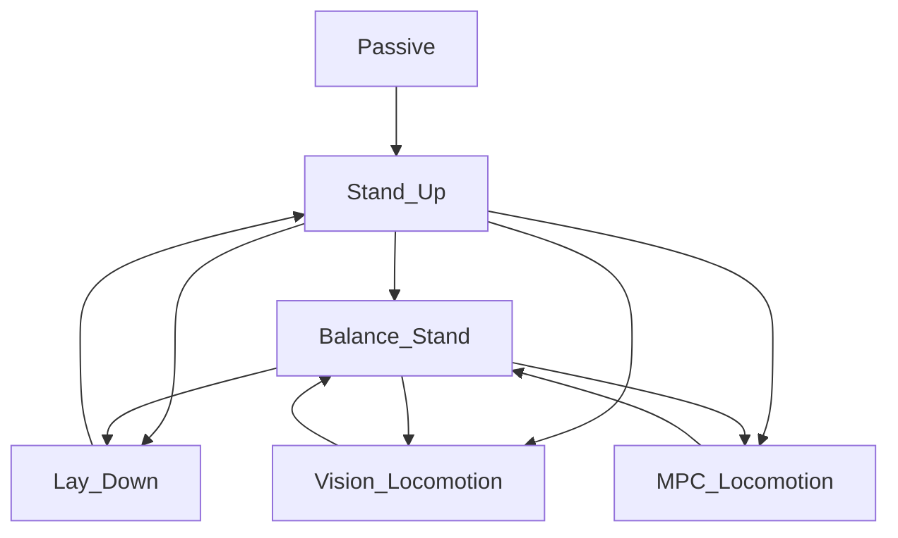
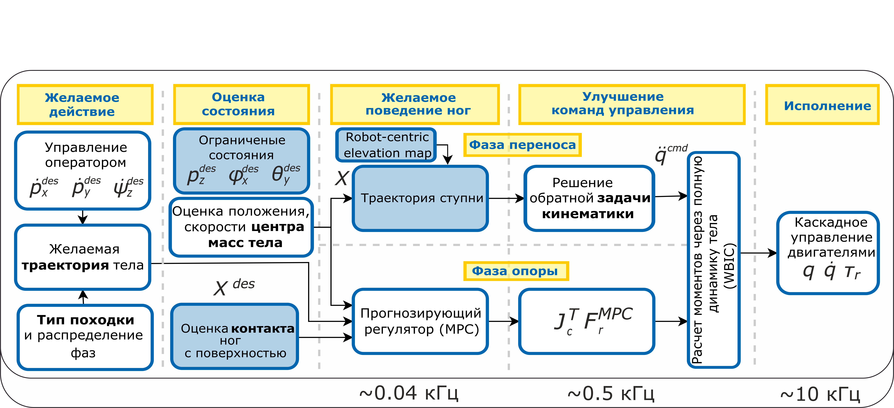
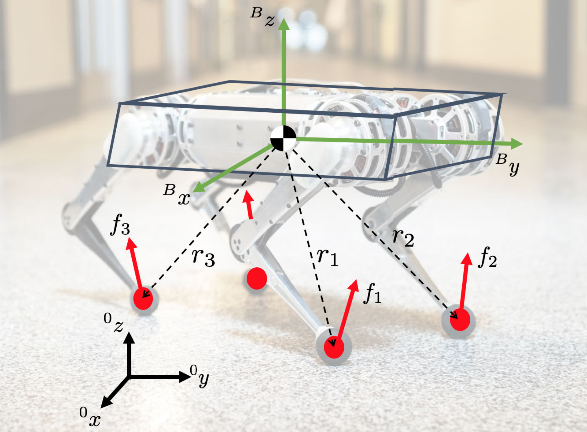
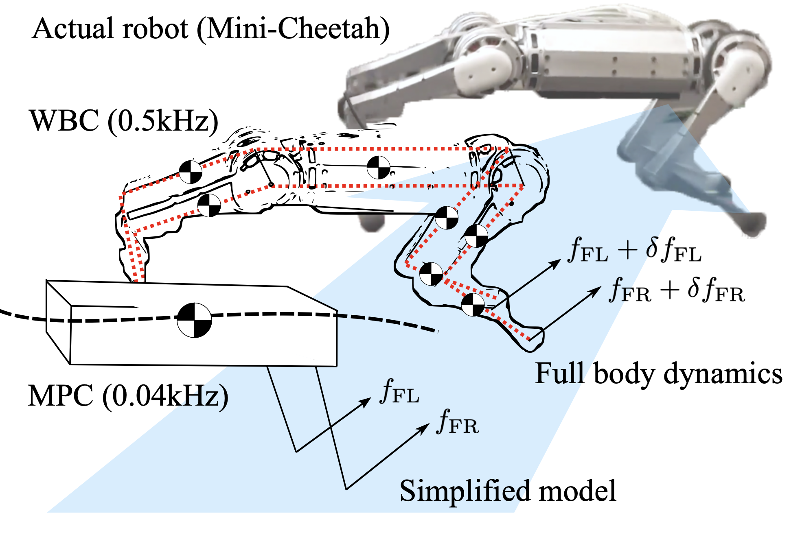
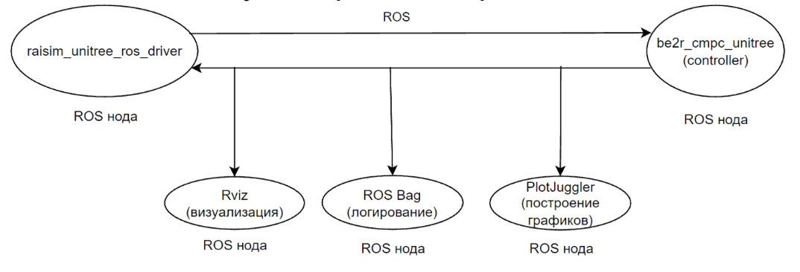
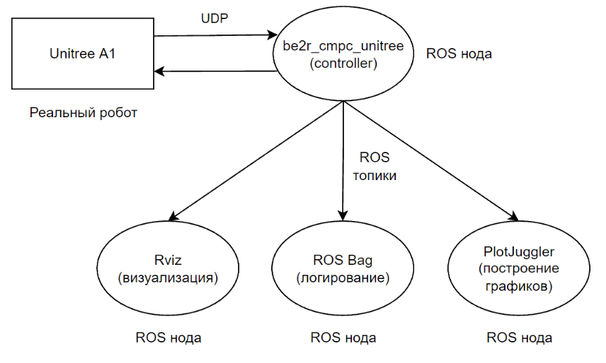
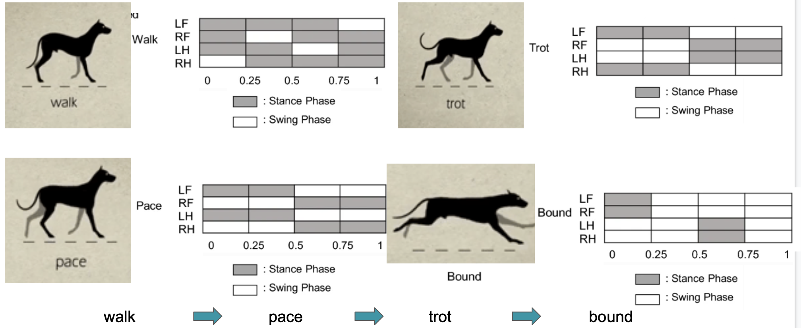
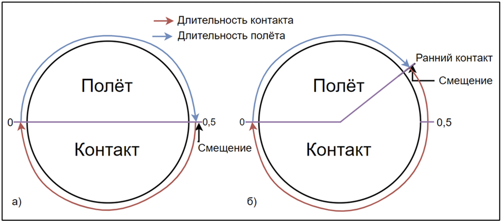

[](url)## Dependencies
Install Eigen3 from apt
```
sudo apt install libeigen3-dev
```
If you build it from source, delete it
```
cd <eigen_dir>/build
sudo make uninstall
```

Install apt dependencies
```
rosdep install --from-paths src --ignore-src -r -y --skip-keys "raisim"
# if not working
sudo apt install ros-noetic-pcl-ros
sudo apt install ros-noetic-grid-map
```

Build from source
```
cd <workspace>/src
git clone https://github.com/anybotics/kindr
git clone https://github.com/anybotics/kindr_ros
catkin build
```

## Usage

# Raisim simulator

Launch the visualizer. You can choose one of the following (opengl is easier for visualization):
```
# unity
roslaunch raisim unity.launch
# opengl
roslaunch raisim opengl.launch
```

Launch the Raisim server:
```
roslaunch raisim_unitree_ros_driver spawn.launch scene:=2
```
Arguments:
- scene - - indicates which objects will be created in the simulator scene.

Launch the controller for the simulator in a separate launch file:
```
roslaunch be2r_cmpc_unitree unitree_sim.launch
```

Launch the controller for the simulator with the universal launch file:
```
roslaunch be2r_cmpc_unitree unitree_a1.launch sim:=true rviz:=false rqt_reconfigure:=true
```
Arguments:
- sim - (bool) whether running in simulation or on a real robot;
- rviz - (bool) whether to start RViz;
- rqt_reconfigure - (bool) whether to start rqt.


Launch rqt to control states and adjust robot parameters (optional):
```
rqt
```

# Real Unitree A1
Launch the controller to control the real robot (separate launch file):
```
roslaunch be2r_cmpc_unitree unitree_real.launch
```

Launch the controller for the simulator with the universal launch file:
```
roslaunch be2r_cmpc_unitree unitree_a1.launch sim:=false rviz:=false rqt_reconfigure:=false
```
Arguments:
- sim - (bool) whether running in simulation or on a real robot;
- rviz - (bool) whether to start RViz;
- rqt_reconfigure - (bool) whether to start rqt.


# Finite State Machine (FSM)
You can exit from a gait state to the Passive state in two ways:
1. From any state directly. The motors switch to damping mode, and the robot smoothly goes to the ground.
2. Switch first to Balance_Stand, then Lay_Down, and finally Passive.


# Control System Description
The file be2r_cmpc_unitree_node contains the main loop for the entire node. By default, it aims to run at 500 Hz. That is, if all computations in the loop body take less than 2 ms, it runs exactly at 500 Hz. Otherwise, the frequency is reduced.

To move, the robot must cycle its legs. Thus, leg motion can be split into two phases: the flight phase (swing) and the ground contact phase (stance). During stance, the control is carried out by two controllers: MPC (Model Predictive Control) and WBC (Whole Body Controller). During the swing phase, only the WBC is active. The time each leg remains in a specific phase is managed by the Gait Scheduler. Specific combinations of stance and swing periods form a gait pattern.

To facilitate testing different controllers as well as different behavior templates, there is a FSM (Finite State Machine). Each state uses its own set of controllers and corresponding gaits.

Robot control is based on desired linear velocities (X, Y) and angular velocity (Z).

Control system architecture:
 

# MPC
A controller implementation close to the one in code is described in the “convex_mpc” article. In the file MPC_to_QP, you can find the detailed derivation showing how the MPC problem is transformed into a QP problem, so that a solver can interpret it properly.

The original implementation of the controller is located in [convexMPC](/src/controllers/convexMPC). Because we modified some parts, we created a copy named CMPC.

The robot’s dynamics model is reduced to a rigid body (a “brick/potato”); the leg dynamics are neglected since their mass is significantly lower than the main body mass. Consequently, we assume leg movement in the air does not affect the body. The state of the body changes only due to the contact forces from the legs pressing on the ground. The final dynamics model is further simplified to the linear form shown below.
```math
\begin{equation*}
    \frac{d}{dt}\begin{bmatrix}
        \hat{\Theta}\\ \hat{p} \\ \hat{\omega} \\ \hat{\dot{p}}
    \end{bmatrix} =
    \begin{bmatrix}
        0_3 & 0_3 &R(\psi) &0_3 \\
        0_3 & 0_3 &0_3 &1_3 \\
        0_3 & 0_3 &0_3 &0_3 \\
        0_3 & 0_3 &0_3 &0_3
    \end{bmatrix} \begin{bmatrix}
        \hat{\Theta}\\ \hat{p} \\ \hat{\omega} \\ \hat{\dot{p}}
    \end{bmatrix}
    + \begin{bmatrix}
        0_3 & \dots &0_3 \\
        0_3 & \dots &0_3  \\
        \hat{I}^{-1}[r_1] &\dots &\hat{I}^{-1}[r_n] \\
        1_3/m & \dots &1_3/m
    \end{bmatrix} \begin{bmatrix}
    
        f_1\\ \vdots\\ f_n
    \end{bmatrix}
    + \begin{bmatrix}
        0\\ 0\\ 0\\ g
    \end{bmatrix}
\end{equation*}
```
There are various implementations for solving the optimization problem in the code: **sparse** and **dense**, along with three different solvers. In the original repository, the default option was **dense + qpOASES**, so we use that as well. We have tested all other options briefly, but did not study them thoroughly since the robot’s behavior visually appeared the same. 
**MPC** runs at about **~30 Гц**. Since this is lower than the main loop frequency (500 Hz), and everything executes sequentially, the MPC controller is called once every set number of main loop iterations (the variable **iterations_between_mpc**).  
Several aspects differ from the article’s description:
1. In the paper, the system matrix (input-state-output) is built based on the average yaw angle **yaw** or $\psi$ over the entire horizon of the body’s desired trajectory. In the code, only the current **yaw** angle is used.
2. In the paper, the system input matrix is computed at each controller iteration for each step of the horizon, depending on which feet are in contact and how the stance footprints change over time. However, in the code, this matrix is computed only once using the current state, and it does not change throughout the horizon (neither the set of feet in contact nor the leg position vectors). 

**Side effect of this controller** - during movement, there is an approximately linear dependence of the body tilt on the current speed. To compensate for this, a simple heuristic is introduced that adjusts the desired body pitch and roll angles depending on the current travel speed: 
- Pitch:
```math
  \theta = k_{u,x} \cdot \dot{x}_{act} + k_{ox} + \alpha^*_x

```
- Roll:
```math
  \phi = k_{u,y} \cdot \dot{y}_{act} + k_{oy} + \alpha^*_y

```
where the last term is expressed as follows:
```math
\begin{equation*}
    \alpha^*_{x,y}=-arccos\left(\frac{n_{x,y} }{\sqrt{n_x^2 + n_y^2 + n_z^2}}\right)+\frac{\pi}{2}
\end{equation*}
```
This heuristic accounts for contact-plane inclination and uses two parameters: the slope factor $k_{u,x}$ and offset $k_{ox}$.  These coefficients were determined experimentally. The heuristic is located in the run method of the CMPC controller and is assigned to the variable _pitch_cmd.
A visual representation of the model and reaction forces:

Note that in our version, the robot body coordinate frame is rotated by 90 degrees around the Z-axis compared to the figure above. Hence, the X-axis points forward, the Y-axis points left, and Z remains upward.

# WBC
The implementation is located in [WBC](/src/controllers/WBC) and [WBC_Ctrl](/src/controllers/WBC_Ctrl).
We do not have much detail on this controller yet since we did not study it in depth. In general, it runs at each iteration of the main loop (500 Hz by default), takes the “draft” ground reaction forces computed by the MPC, and calculates the desired joint torques using the full robot dynamics through an optimization procedure.

Publications mention two versions: **WBC** and **WBIC** (Whole Body Controller, Whole Body Impulse Controller). In the code, it seems WBIC is used, since the controller’s source files are named WBIC. Essentially, WBC_Ctrl serves as a WBIC interface, and we see the force handoff from MPC to the full body model there.

WBIC runs at each main loop iteration, i.e., at 500 Hz.

A schematic representation of combining both controllers:


# Leg swing trajectory generator
The implementation is in [FootSwingTrajectory](/src/common/Controllers)  
The flight phase trajectory of the legs is a composite Bezier spline. X and Y coordinates change linearly over time, while Z is built from three points using two Bezier curves. The first and second points are the start and end Z-coordinates of the trajectory, and the third is the start Z-coordinate plus the step height. The third point lies between the first two and is the apex of the foot trajectory. This trajectory is constructed in the world frame, and the phase of leg swing is used as the basis function.

The second point, or the foot's landing point, is computed using the following heuristic:
```math
\begin{equation*}

p_{step,i}=\left[p_{h,i}+R_z\left(\phi_k\right)l_i\right]+ \left[ \frac{T_{stance}}{2} \dot{p}_c+k\left(\dot{p}_c -\dot{p}_{c,d}\right)\right]+ \left[\frac{1}{2}\sqrt{\frac{z_0}{9.81}}{\dot{p}}_c\times \omega_d\right]

\end{equation*}
```
Here, the first bracket $[\dots]$ offsets the leg relative to the body center at that leg’s shoulder, the second bracket $[\dots]$ is the **Raibert heuristic** with speed control ($k=0.3$), and the last bracket $[\dots]$ describes the concept of a **Capture point** (or (**ZMP**) Zero Moment Point).
# Leg Controller
Implemented in the [LegController](/src/common/Controllers)  
This class stores current and desired leg states, control commands, and computes the Jacobian matrix. The numbering of each leg’s joints starts from the shoulder. The numbering of legs and joints is:

- 0 – front right, joints 0, 1, 2
- 1 – front left, joints 3, 4, 5
- 2 – rear right, joints 6, 7, 8
- 3 – rear left, joints 9, 10, 11


# Body Manager
Implemented in [be2r_cmpc_unitree](/src/be2r_cmpc_unitree)  
This is the top-level class where all other class instances are created, passed into each other’s constructors, and where the main run method of the FSM is called. It provides the primary ROS interface for interacting with the simulator and handles key callbacks. It also calculates the final torque sent to the robot. The torque is computed as follows:


```math
  \tau = K_{p_j}(q_{des}-q_{act}) + K_{d_j}(\dot{q}_{des}-\dot{q}_{act}) + \tau_{ff_{cmd}} 

``` 
```math 
\tau_{ff_{cmd}} = J^TF_{foot} 
```
```math 
F_{foot} = K_{p_{cart}}(p_{des}-p_{act}) + K_{d_{cart}}(\dot{p}_{des}-\dot{p}_{act}) + F_{ff} 
```

- $K_{p_j},K_{d_j}$ -- PD joint coefficients;
- $K_{p_{cart}},K_{d_{cart}}$ -- PD Cartesian coefficients;
- $F_{ff},\tau_{ff}$ -- Feedforward control: Force from MPC calculation, torque from WBIC calculation respectively;
- $q,p$ -- The joint angle  and position of the leg's feet.


Because the original repository was written for a different robot, the sign convention for the second and third joints of each leg differs from the Unitree A1. We must invert the sign for their positions and velocities when reading from the robot, and similarly invert the sign of torque when sending commands to the robot.

# Launch Architecture
You can launch the controller for either the simulator or the real robot. RaiSim is used as the simulator. To work with the dog in the simulator, you should launch the [raisim_unitree_ros_driver.launch](/launch). The exchange of data between the controller and the simulator happens via ROS topics. Communication with the real robot happens via UDP. Therefore, the code has a flag is_udp. When it’s set, data exchange is done with [unitree_legged_sdk](https://gitlab.com/rl-unitree-a1/unitree_legged_sdk). The SDK exists in different versions for different models of robots. We forked a certain version that worked with our robot. The SDK also has a built-in safety function that checks the current state and a maximum allowed power limit in increments of 10% (if you send 4, for example, that’s a 40% power limit). If the actual power exceeds that limit, the controller shuts down and prints an error message to the terminal.

Because the actuators have their own high-frequency PD loop, and the original control system also has a PD loop for the joints (see LegController, final torque formula), we added a flag is_low_level. When this flag is set, the PD gains for the joints are sent to the lower level, and the PD terms in the final formula are set to zero.

Launch architecture with the simulator:
  
Launch architecture with the real robot:  
  

# Messages
In Unitree’s repository, there is a package [unitree_legged_msgs](https://gitlab.com/rl-unitree-a1/unitree_legged_msgs),  that contains ROS messages analogous to the data structures used to communicate with the real robot. We copied the repository without changing the original messages, but we added our own custom ones. Two structures are used for data exchange with the robot: LowCmd and LowState. LowCmd contains the desired low-level commands, while LowState contains the current low-level robot state (positions and velocities of all joints, IMU data, etc.).  

# Configuration
Node configuration consists of static and dynamic ROS parameters, all in the [config](/config). The main static parameters are in ros_config under the static_params prefix. Since we partially tested the code on Unitree Go1, we created additional config files for each robot model: config_a1_real(sim) and config_go1_real(sim). For each robot, there is a simulator configuration (..._sim) and a real-robot configuration (..._real). These differ because we fine-tune parameters for improved performance in both scenarios. We also separate out joint limits for each robot into joint_limits_a1 or joint_limits_go1. Therefore, in the launch files, there is a robot_type argument specifying the model: [a1, go1].  
Dynamic parameters are defined in [ros_dynamic_params.cfg](/config). You can set initial values there, but changes to that file require recompilation. Therefore, all dynamic parameters from this file are duplicated in ros_config under the dynamic_loader prefix. When the controller’s launch file starts, a node reads these initial dynamic parameters and loads them into dynamic_reconfigure. With this small workaround, we can change all parameters without recompiling. 
The main parameters we typically adjust:
- gait_period - the period of all gaits in MPC iterations
- joint_limits - turning on joint position limits. If any joint exceeds its allowed range, the controller immediately turns off and switches motors to damping
- body_height - the robot’s body height to maintain during walking. The height is defined relative to the legs
- swing_traj_height - the height to which the legs should be lifted during swing phase
- cmpc_gait - the default gait ID

# Parameterization
All the robot’s dynamic and kinematic parameters are in [MiniCheetah.h](/src/common/Dynamics). These values are taken from the official URDF file of Unitree's GitHub repository.

# Odometry (Position and Orientation estimators)
The implementations are in [PositionVelocityEstimator](/src/common/Controllers) and [OrientationEstimator](/src/common/Controllers)  
The orientation is taken directly from the IMU. OrientationEstimator computes the rotation matrix between the robot’s body and the world frame. The robot’s position is estimated using a Kalman filter. It estimates the position in the X,Y plane (in the world frame), but not Z. The robot’s height (Z) is estimated relative to the feet in contact, so with respect to a strict TF tree, you can say the odom frame is shifted in Z compared to the world frame. For example, if the dog goes upstairs, the odom frame moves up. Visualizing it requires the actual height of the robot body in the world frame.

The estimation of “local height” was changed. Now the X,Y position estimation works as before, but the original Z estimator is replaced. The new algorithm determines the body height relative to the plane defined by the last 4 foot contact points.  

# Debug
Implemented in the [debug](/src/common/debug).  
We created a Debug class for easy debugging of the controllers. It collects all current system state information and publishes it to separate topics for plotting in PlotJuggler or visualizing in RViz.

# Finite State Machine (FSM)
Implemented in the [fsm](/src/fsm). That folder also contains the definitions of all states. Each state has its own folder.
The FSM is used to implement different robot behaviors for various use cases.

A brief overview of the main states:

- Passive: The robot does nothing; the motors are disabled.
- StandUp: The robot stands up from a lying position in preparation for walking. In this state, an impedance controller is used for each leg. The positions of all legs in shoulder coordinates are recorded, then the desired Z is changed by 25 cm via linear interpolation. This is the original approach— it doesn’t work great, since the legs behave somewhat like springs. We added gravity compensation, but it did not drastically improve performance.
- BalanceStand: The robot stands on four legs, with the ability to change orientation and body height.
- Locomotion_baseline: The original built-in walking gait. We kept it unchanged to compare our new version with the original. We only added debug outputs.
- Locomotion: A test state used for developing blind walking. We used this state in all demos.
- LocomotionCV: A state with visually-guided gaits.
- LayDown: The opposite of StandUp, where the robot lowers itself to the ground. Not recommended; it’s usually better to switch directly to Passive.

# Gait scheduler
There are two implementations: [GaitScheduler](/src/common/Controllers) and [Gait](/src/controllers/convexMPC) (or its copy [Gait_Contact](/src/controllers/CMPC)) [deprecated]. The code only uses Gait.  
A gait is a pattern of stance and swing durations for each leg. Any gait can be specified via two parameters per leg: the fraction of the gait period allocated to stance, and the phase offset for the start of stance. The total gait period is specified by the number of MPC iterations. For example, with iterations_between_mpc = 13 and gait_period = 18, and a stance phase that’s half the gait cycle, the stance duration for a leg will be 0.002 * 13 * 18 / 2 = 0.234 с.
Gaits are defined in a list in the constructor of the controllers, for example in the constructor of convexMPCLocomotion in [convexMPCLocomotion](/src/controllers/convexMPC). Each gait has its own ID (e.g., 4 for standing, 9 for trot). The ID is assigned in the main MPC run loop.

Below is a visual example of typical animal gait patterns (https://www.youtube.com/watch?v=PVvZKcKBTtg):  
  
A schematic representation of a single leg’s gait cycle:  


# CV walking
To run with vision and an elevation map, you need the repository: [elevation_map](https://gitlab.com/rl-unitree-a1/elevation_map)

# During the development, various open source repositories were used as a basis
https://github.com/mit-biomimetics/Cheetah-Software

# Article
Artem A.Egorov, Maxim V. Lyahovski, Denis A. Sokolov, Alexey M.Burkov, Sergey A. Kolyubin. Design and performance evaluation of receding horizon controllers for quadrupedal robots: case study on stairs climbing and balancing.[HERE](doc/IFAC_WC_quadro__3_.pdf)
